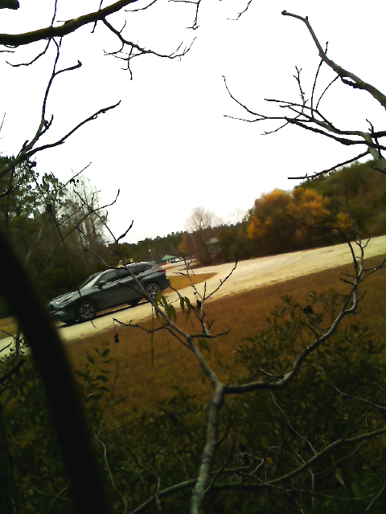

# Kismet Camera Server

Kismet Camera Server is designed to be hosted on a remote device to take photos that could potentially correlate to MAC addresses based on user defined RSSI threshold.
The trigger for the server to take a photo and perform an API call to the locally hosted Kismet Server is either by motion, detected by the camera, or by the existance 
of a strong RSSI that exceeds the user defined RSSI threshold. 
## In Action

MAC: 8EBF11199C15 at -71 RSSI (Thanks PB for the help)

## Dependencies
- python3
- Kismet

## Installation

### Ubuntu 20.04

```
$ git clone https://github.com/GrokkedBandwidth/kismet_camera_server.git
$ cd kismet_camera_server/
$ pip3 install -r requirements.txt
```

### Raspbian (Buster)

```
$ sudo apt update
$ sudo apt upgrade -y
$ sudo apt install -y build-essential cmake pkg-config libjpeg-dev libtiff5-dev libpng-dev libavcodec-dev libavformat-dev
libswscale-dev libv4l-dev libxvidcore-dev libx264-dev libfontconfig1-dev libcairo2-dev libgdk-pixbuf2.0-dev
libpango1.0-dev libgtk2.0-dev libgtk-3-dev libatlas-base-dev gfortran libhdf5-dev libhdf5-serial-dev libhdf5-103
libqt5gui5 libqt5webkit5 libqt5test5 python3-pyqt5 python3-dev libreadline-gplv2-dev libncursesw5-dev libssl-dev
libsqlite3-dev tk-dev libgdbm-dev libc6-dev libbz2-dev libgtkmm-3.0-1 libnotify4 libcblas-dev libhdf5-dev
libhdf5-serial-dev libatlas-base-dev libjasper-dev libqtgui4 libqt4-test
$ pip3 install -U numpy
$ git clone https://github.com/GrokkedBandwidth/kismet_camera_server.git
$ cd kismet_camera_server/
$ pip3 install -r requirements.txt
```
Thanks to Sam Westby Tech for figuring out how to get opencv working on Raspberry Pi
https://www.youtube.com/watch?v=QzVYnG-WaM4&ab_channel=SamWestbyTech

## Launching
```
$ cd kismet_camera_server/
$ python3 main.py
```
To access the server once running navigate to:
```
http://127.0.0.1:5000
OR
http://<RemoteServerIP>:5000
```
Once parameters are set, hit 'Start Capture'

## Adjustable Constants
Certain parameters, like motion detection or AP detection can be adjusted within the server itself, but other constants, like CAMERA and COUNT, need to be accessed in the main.py. Below is a brief description of each constant and where it can be currently accessed:

#### MOTION_DETECTION
This constant by default is set to True and can be adjusted in the server once running. If set to True, kismet camera will only take photos and perform an API call when motion is detected within the field of view of the camera. To prevent excessive API calls and photos, the time betweeon motion detection procs is 5 seconds. If set to False, the kismet camera will perform API calls to the local Kismet Server every 5 seconds and if a RSSI is seen that exceeds the RSSI threshold, the camera will take photos and the RSSIs that exceeded threshold will be recorded. 

#### GRAB_APS
This constant by default is set to False and can be adjusted in the server once running. If set to True, AP RSSIs that exceed the RSSI threshold will also be recorded, along with other devices. If set to false, AP RSSIs will be ignored.

#### TARGET_RSSI
This constant is set to -72 default and can be adjusted in the server once running. Any signal meeting or exceeding this value will be recorded in the csv generated by the server.

#### USERNAME, PASSWORD, IP
These constants are defaulted to 'kismet', 'kismet', and 'localhost' respectively. Change these if you login information for kismet is different from the default or if the IP you are monitoring is different. The Username and Password can be adjusted within the server once running, but the IP will need to be adjusted in a text editor.

#### COUNT
This constant is set to 3 by default and is currently not adjustable within the camera server. This constant designates how many photos will be taken per proc, whether is motion or RSSI based. There is a .5 second delay between each photo to take into consideration. 

#### CAMERA
CAMERA designates which camera to use for the application. Observed behavior for a Surface Pro is below:
0: Front facing camera, if it exists
1: Back facing camera, if it exists
2: Additional cameras
With this in mind, if a device, like a Raspberry Pi, does not have an onboard camera, the first camera added will be 0

#### START
START designates whether or not the application is actually 'capturing' meaning that it can be triggered to take photos
and make API calls by either motion or RSSI detection. If set to True, application will start as soon as launched

#### STREAM
STREAM determines whether the camera feed is live when the server is accessed. This constant does not impact capture
meaning that even when STREAM is False, the camera server will behave as normal when capturing. 

#### SENSITIVITY
SENSITIVITY dictates the size of an object or distance of an object from the camera to trigger motion detection. This constant will
need to be altered and tested before employment depending on the distance your target spot is from your sensor. A value
of 10000 will set off motion detection when waving a hand in front of a webcam.

#### ROTATION is an integer variable that designates the rotation of the camera image as well as the images that are taken
when the camera is triggered. Default is 0 


